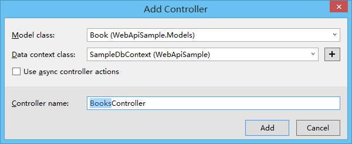

# WebApi教程

## 使用Api基础模板
* 1.新建带有`Enitity Framework`增删改查模板的控制器


* 2.选择控制器强类型和数据库上下文


* 3.模板Api代码生成


## Jsonp跨域访问
* 1.自定义jsonp返回：
```c#
    public HttpResponseMessage GetBooks(string callback)
    {
        string func = $"{callback}({JsonConvert.SerializeObject(db.Books)})";
        return new HttpResponseMessage(HttpStatusCode.OK)
        {
            Content = new StringContent(func, Encoding.UTF8, "text/javascript")
        };
    } 
```
* 2.添加jsonp的格式化器(全局支持jsonp调用)：
  * 安装依赖：`Install-Package WebApiContrib.Formatting.Jsonp` 
  * 引入配置：
```c#

    using WebApiContrib.Formatting.Jsonp;

    public static void Register(HttpConfiguration config)
    {
        // Web API 配置和服务

        // Web API 路由
        config.MapHttpAttributeRoutes();

        config.Routes.MapHttpRoute(
            name: "DefaultApi",
            routeTemplate: "api/{controller}/{id}",
            defaults: new { id = RouteParameter.Optional }
        );

        // 添加jsonp的格式化器
        config.AddJsonpFormatter();
    }
```

## CORS跨域访问
* 安装依赖：`Install-Package Microsoft.AspNet.WebApi.Cors`
* 引入配置：
```c#
    public static void Register(HttpConfiguration config)
    {
        // Web API 配置和服务

        // Web API 路由
        config.MapHttpAttributeRoutes();

        config.Routes.MapHttpRoute(
            name: "DefaultApi",
            routeTemplate: "api/{controller}/{id}",
            defaults: new { id = RouteParameter.Optional }
        );

        // 添加cors跨域配置
        config.EnableCors();
    }
```
* 使用配置：
```c#
    // 指定api接口请求的白名单：只有来自 http://localhost:53462 的请求方可访问
    [EnableCors(origins: "http://localhost:53462",headers:"*",methods:"*")]
    // GET: api/Book
    public IQueryable<Book> GetBooks()
    {
        return db.Books;
    }
```

## Swagger UI 的使用
* 安装依赖：`Install-Package Swashbuckle`
* 生成项目xml文档：

* 指定xml路径：
```c#
    protected static string GetXmlCommentsPath()
    {
        var baseDir = AppDomain.CurrentDomain.BaseDirectory;
        var fileName = Assembly.GetExecutingAssembly().GetName().Name + ".xml";
        var file = Path.Combine(baseDir, "bin", fileName);
        return file;
    }
```

## 自主宿主HttpSelfHost
* 安装依赖：`Install-Package Microsoft.AspNet.WebApi.SelfHost`
```c#
    static void Main(string[] args)
    {
        //加载插件
        var files = Directory.GetFiles(Path.Combine(Environment.CurrentDirectory, "plugins"))
            .Where(f=>f.ToLower().EndsWith(".dll")).ToList();
        files.ForEach(file => Assembly.LoadFile(file));

        //配置主机
        var address = "http://127.0.0.1:8081";
        var config = new HttpSelfHostConfiguration(address);
        //配置路由
        config.Routes.MapHttpRoute("Default", "api/{version}/{controller}/{id}", new { version = RouteParameter.Optional, id = RouteParameter.Optional });

        // 自定义api根据需求返回格式
        config.Formatters.JsonFormatter.MediaTypeMappings.Add(new QueryStringMapping("format", "json", "application/json"));
        config.Formatters.XmlFormatter.MediaTypeMappings.Add(new QueryStringMapping("format", "xml", "application/xml"));

        //监听HTTP
        var server = new HttpSelfHostServer(config);
        //开启来自客户端的请求
        server.OpenAsync().Wait();
        Console.WriteLine($"服务已经启动 {address} 请按任意键键退出");
        Console.ReadKey();
    }
```

## 文件上传与下载
* [Asp.Net WebApi2 文件图片上传与下载功能](https://www.jb51.net/article/114903.htm)
* [Asp.Net WebApi2 利用ByteArrayContent和StreamContent分别实现下载文件示例](https://codedefault.com/p/asp-net-web-api-2-use-bytearraycontent-and-streamcontent-download-multiple-file-include-compress-zip)

## 结果展示


## 扩充：
* 自定义根据参数返回格式：
```c#
    public static void Register(HttpConfiguration config)
    {
        // 自定义api根据需求返回格式
        config.Formatters.JsonFormatter.MediaTypeMappings.Add(new QueryStringMapping("format", "json", "application/json"));
        config.Formatters.XmlFormatter.MediaTypeMappings.Add(new QueryStringMapping("format", "xml", "application/xml"));

        // Web API 配置和服务

        // Web API 路由
        config.MapHttpAttributeRoutes();

        config.Routes.MapHttpRoute(
            name: "DefaultApi",
            routeTemplate: "api/{controller}/{id}",
            defaults: new { id = RouteParameter.Optional }
        );

        // 添加jsonp的格式化器
        config.AddJsonpFormatter();

        // 添加cors跨域配置
        config.EnableCors();
    }

    // 具体请求使用案例：
    /api/book?format=json
    /api/book?format=xml
```
